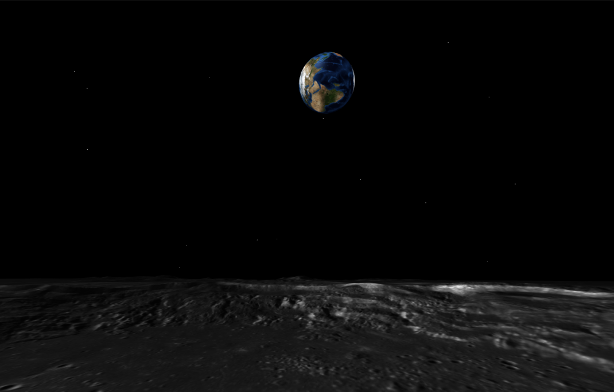
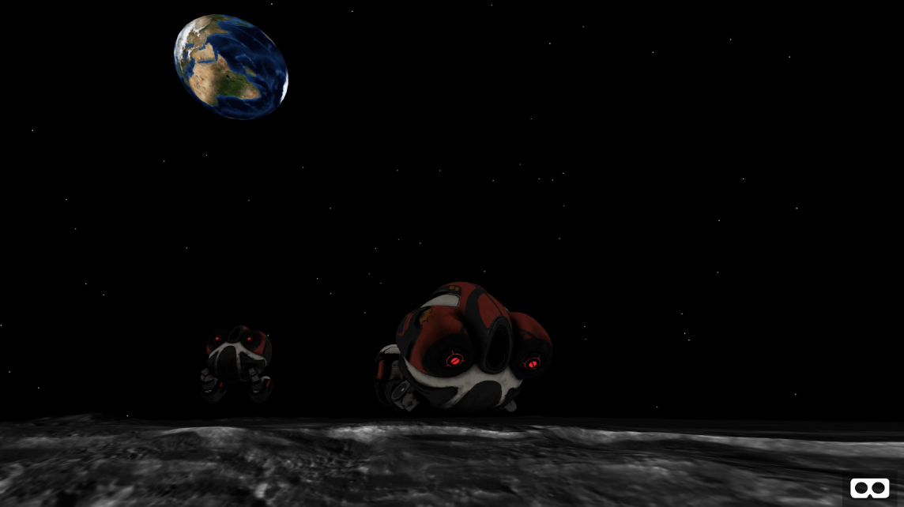

# [Space App Challenge Hackathon 2018](https://2018.spaceappschallenge.org/challenges/universe-beauty-and-wonder/virtual-space-exploration/teams/what-the-fun/project)

## What-The-Fun Team

We built a Virtual Reality Moon Exploration Web App using [A-Frame](https://aframe.io/). A-Frame is freaking powerful. <3

## Demo

### Controls

- Use arrow keys on desktop browser or touch swipe on mobile browser to explore the Moon
- If you own an Oculus Rift, you can use the touch controller to point at the objects to display description.

### Websites

- https://cryptic-brook-34281.herokuapp.com/ (run on a server to enable multiplayer)
- https://what-the-fun-a0b3f.firebaseapp.com/ (static website)

## Notes

Everything is done in a rush to make things work. Don't judge. ^^ Model of POV is in the wrong direction because I honestly thought the rear lights were eyes of the robot.
